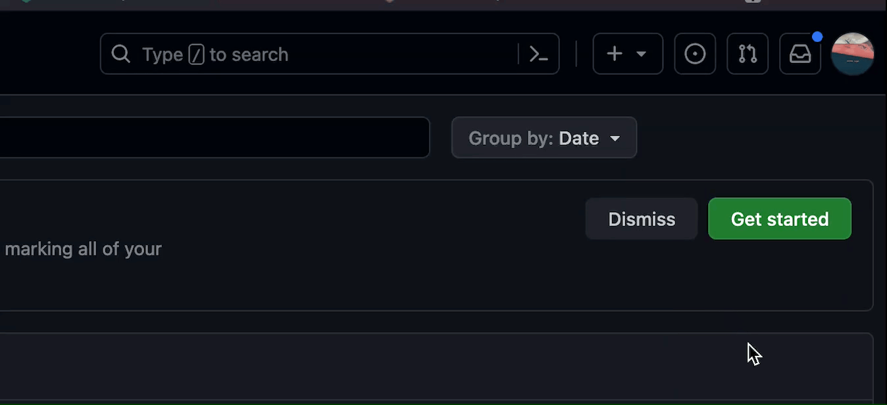
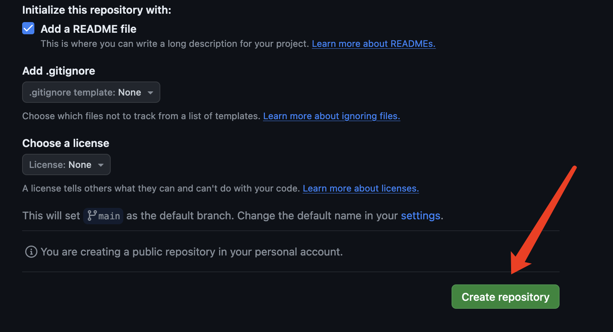

# How to Host a Resume on GitHub Pages

This guide walks you through the process of creating a resume using Markdown and hosting it on GitHub Pages for free. Utilize this powerful combination to present your professional profile to the world in a neat, web-accessible format.


## Prerequisites

Before starting, ensure you have the following:

1. A resume formatted in Markdown. If you're new to Markdown, consider going through a [Markdown Tutorial](https://www.markdowntutorial.com/).
2. A [GitHub account](https://github.com/signup) - sign up if you haven't already.
3. Familiarity with GitHub Pages. Check out [GitHub Pages documentation](https://pages.github.com/) for a primer.

## Contents

- [Creating the Repository](#creating-the-repository)
- [Selecting a Quick Theme](#selecting-a-quick-theme)
- [Publishing Your Resume on GitHub Pages](#publishing-your-resume-on-github-pages)
- [Principles of Modern Technical Writing](#principles-of-modern-technical-writing)
- [FAQs](#faqs)
- [More Resources](#more-resources)
- [Authors and Acknowledgements](#authors-and-acknowledgements)

---

## Instructions

### Creating the Repository

1. Log into your GitHub account and click on the '**+**' symbol at the top right corner, then select "**New Repository**".
   
   

2. Name your repository "`username.github.io`", where `username` is your GitHub username.
   
3. Set the repository to "**Public**" and initialize it with a README file.
   
  

4. Click on "**Create Repository**".
   
   

5. Clone the repository to your local machine using VS Code or your preferred IDE.

---


### Selecting a Quick Theme

1. Visit [GitHub Pages themes](https://pages.github.com/themes/) to choose a theme for your resume.


2. Configure the theme on your repository's settings.
add the new file called "_config.yml" which include the theme commend line we just copied. e.g.
```
remote_theme: pages-themes/hacker@v0.2.0
plugins:
- jekyll-remote-theme # add this line to the plugins list if you already have one
```


## Publishing Your Resume on GitHub Pages

1. Commit and push your changes to the repository.

2. Enable GitHub Pages in your repository's settings, under the "GitHub Pages" section.


3. Access your resume at `https://username.github.io`.

---

## Principles of Modern Technical Writing

- Use plain language and a minimalist approach for clarity.
- Write in Markdown for easy formatting and conversion.
- Include screenshots and diagrams to explain complex concepts.

---

## FAQs

- **Why is my resume not showing up?** Ensure the file is named `index.md` and committed to the repository.
- **What tools can I use for Markdown editing?** Consider online editors like Dillinger or IDEs with Markdown support such as Visual Studio Code.

---

## More Resources

- [Easy Markdown Tutorial](https://www.markdowntutorial.com)
- [GitHub Flavored Markdown Cheat Sheet](https://guides.github.com/pdfs/markdown-cheatsheet-online.pdf)
- ["Modern Technical Writing" by Andrew Etter](https://www.amazon.com/Modern-Technical-Writing-Introduction-Documentation-ebook/dp/B01A2QL9SS)

---

## Authors and Acknowledgements

**Author:** Your Name ([GitHub Profile](https://github.com/Fyfe-c))

**Acknowledgements:** Special thanks to Anthony Phung and all who provided feedback and support.

